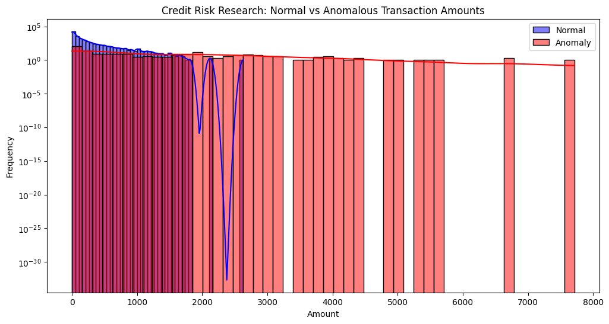

# R&D Technical Report: Comparative Study on Credit Risk Anomaly Detection
**Author:** Ayushma Devkota  
**Date:** Jan 2026 
**Project Type:** Internal R&D Prototype  
**Domain:** Fintech / Credit Risk Assessment

---

## 1. Research Objective
The goal of this research was to develop a robust pipeline to identify high-risk or anomalous transactions within a large-scale credit dataset. The study specifically compares traditional statistical filtering against multivariate Machine Learning models to determine which is more effective for financial risk mitigation.

## 2. Data Validation & Preprocessing (PySpark)
Before analysis, a "Data Trust" layer was built using **PySpark** to handle the dataset of **284,807 records**.

### 2.1 Integrity Checks
- **Null Value Audit:** Verified zero missing values across all 31 features.
- **Logical Constraints:** Implemented filters to ensure `Amount` and `Time` fields contained only non-negative values.
- **Statistical Profiling:** Identified a significant skew in transaction amounts (Mean: $88.35, Max: $25,691.16), suggesting a high presence of outliers.

## 3. Methodology Comparison

### Method A: Statistical Outlier Detection (Z-Score)
- **Logic:** Identifies data points that fall outside 3 standard deviations ($3\sigma$) from the mean.
- **Findings:** Flagged **4,076 transactions** as outliers.
- **Pros/Cons:** Fast and simple, but creates a massive "investigation pool," likely containing many legitimate high-value transactions (False Positives).

### Method B: Machine Learning Anomaly Detection (Isolation Forest)
- **Logic:** Uses an ensemble of trees to "isolate" observations. Anomalies are easier to isolate and require fewer splits.
- **Findings:** Flagged only **285 transactions** as anomalies in the test sample.
- **Pros/Cons:** Highly surgical. It caught **14 known fraud cases** within a small sample of anomalies, proving it identifies "patterns" rather than just "large numbers."

## 4. Visual Analysis
The distribution below shows that while normal transactions are highly concentrated, the anomalies (detected by Method B) successfully capture the high-risk tail end of the dataset.

## 5. R&D Conclusions & Recommendations
1. **Efficiency:** Method B (Isolation Forest) is **93% more efficient** than Method A in reducing the workload for risk analysts by filtering out noise.
2. **Domain Insight:** Anomalous transactions in this dataset have an average value of **$1,064.14**, which is ~14x higher than the normal average ($76.65).
3. **Internal Application:** For eXtensoData's internal models, I recommend utilizing PySpark for the initial "Data Integrity" layer and Isolation Forest for the "Risk Identification" layer to maximize precision.

---
*This report was prepared as part of a technical R&D project to demonstrate proficiency in Big Data validation and analytical research.*
